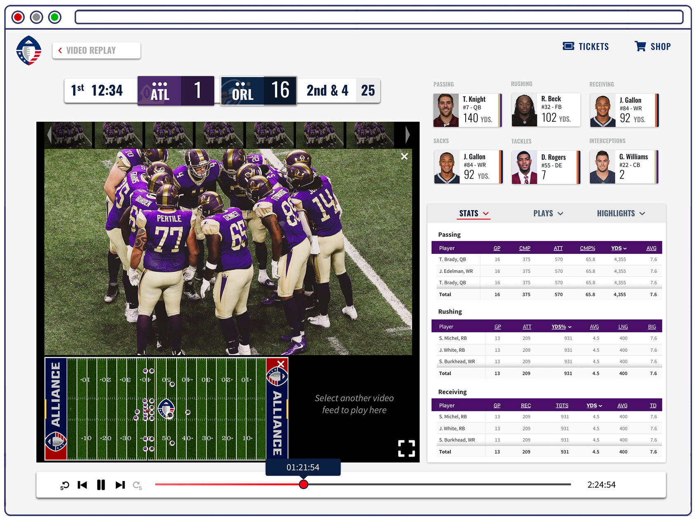
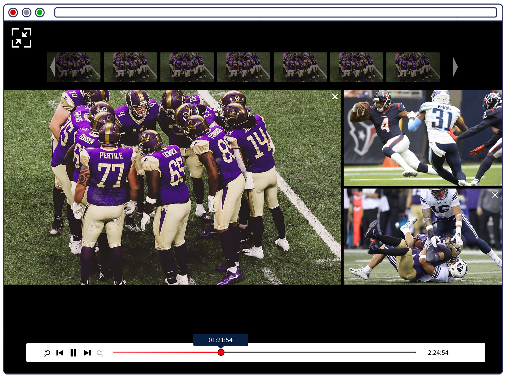
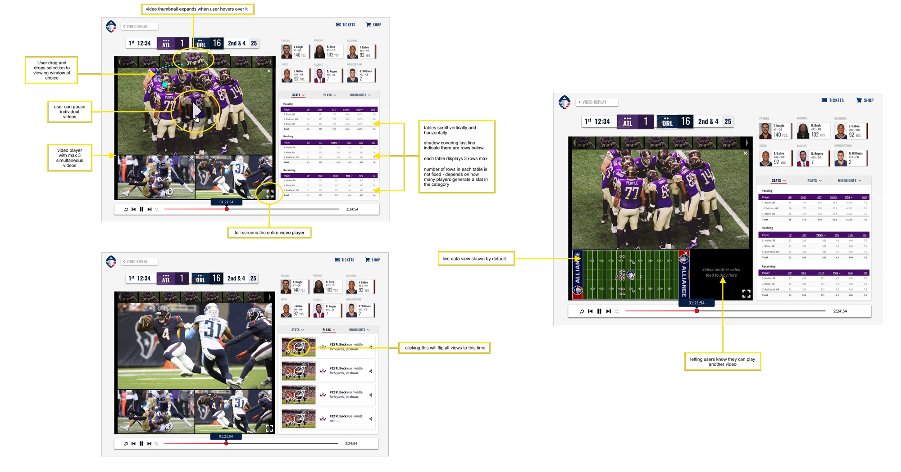
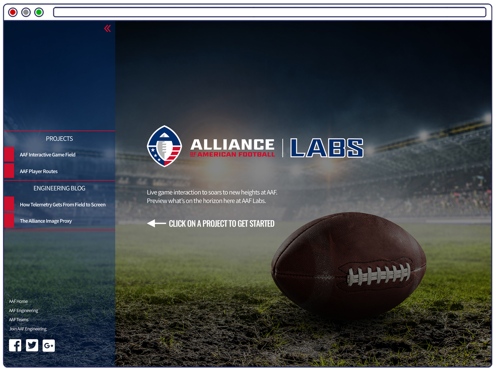
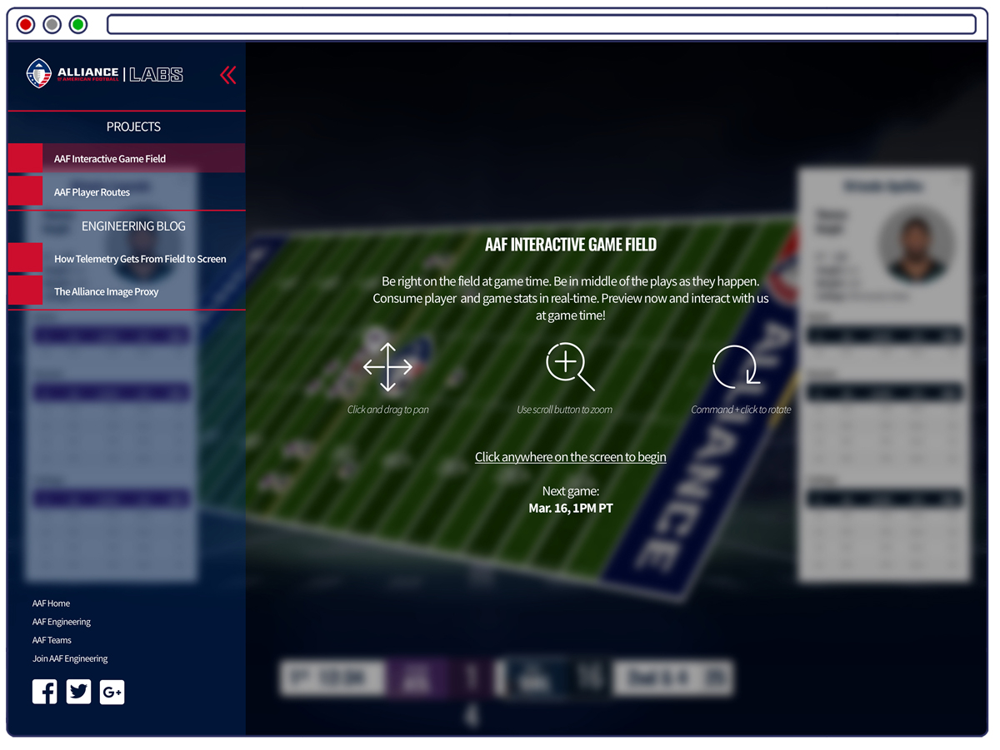
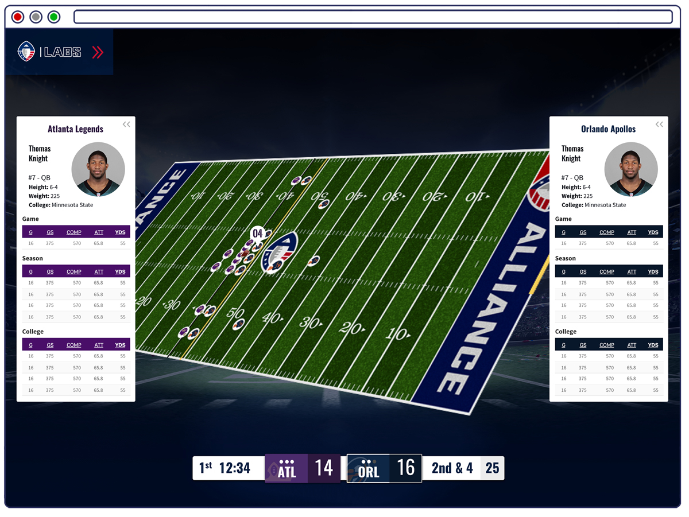

AAF was the tech-centric pro football league offering a digital interactive experience allowing fans to experience the game like never before. The site offered multi-feed video streaming and paired real-time player telemetry with 3D interactivity. Standard features of a sports league website also included - stats for players, teams, league, standings, tickets, etc.

Besides working at max speed building out the new website, I took the opportunity to develop the vision for more exploratory projects further on the horizon. Simply because if someone gave the opportunity to build cool stuff, grab it and maximize it.

### Interactive Game Replay Center

In line with the goal of taking the interactive digital game experience to new heights, we sought to offer a post game experience just as innovative as the live game experience. Introducing the Interactive Game Replay Center. Rather than the standard Game Center where fans could view the resulting scores and the video replays, this Game Center would allow the fans to interact with the scoreboard, multiple video feeds, replay highlights, stats, and recorded player telemetry, all controlled by a global scrubber - all the elements would display the state of the game as if it was in exact moment.

Fans can maximize just the video player portion if they weren't interested in the stats.

##### Process Documents

For my presentation of my vision for this product to the extended team, I created several documents to assist. 

### AAF Labs

The Labs portion of the website was to be a testing ground for new features. The tech team was constantly churning out cutting edge ideas of elevating the digital sports experience. Labs was a place we could direct beta users play and test out these features and offer their feedback before we moved the feature to primetime.

