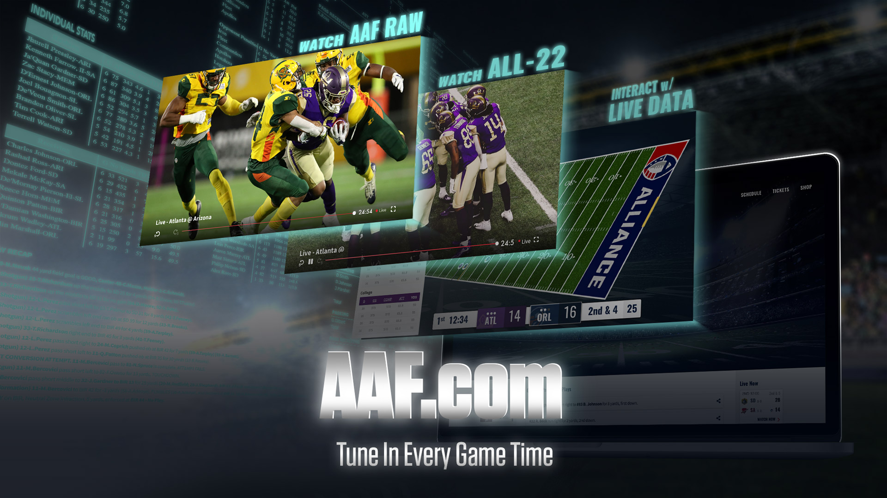
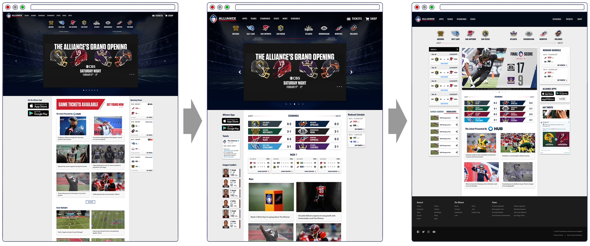
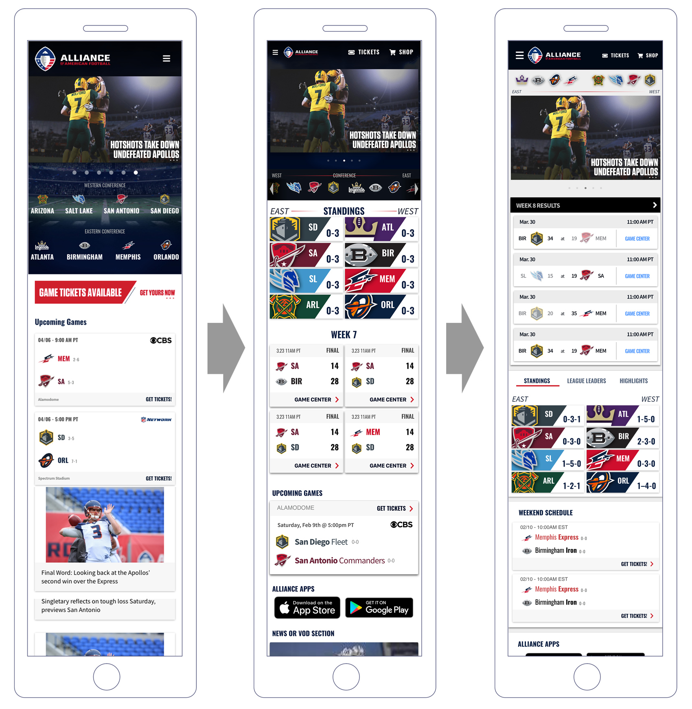
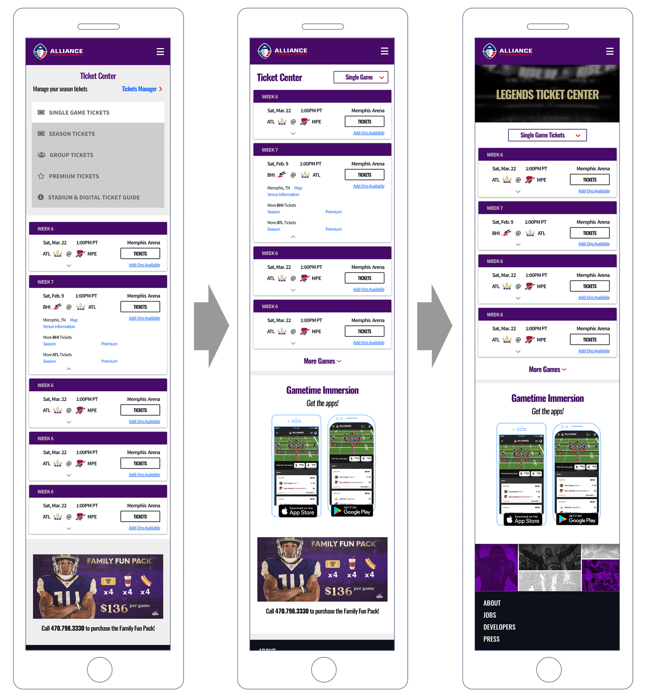
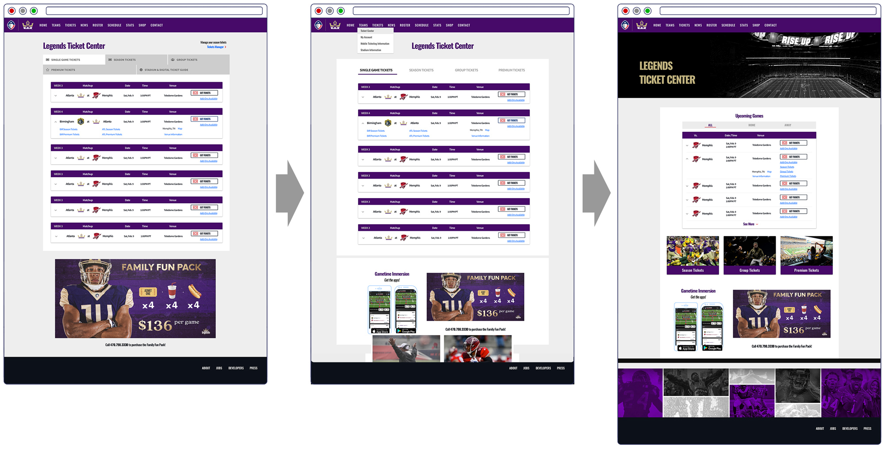
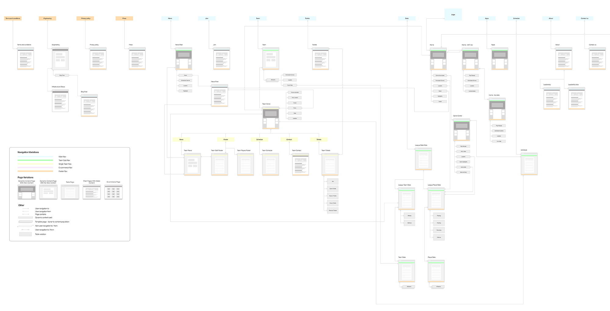
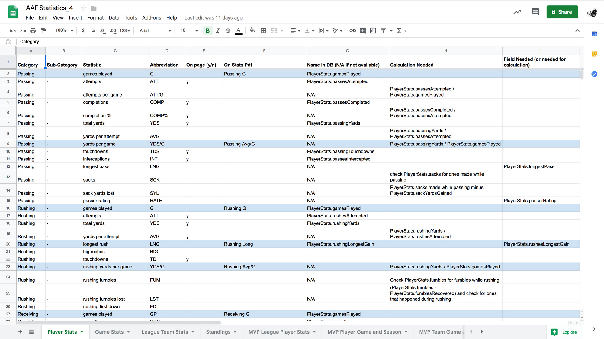
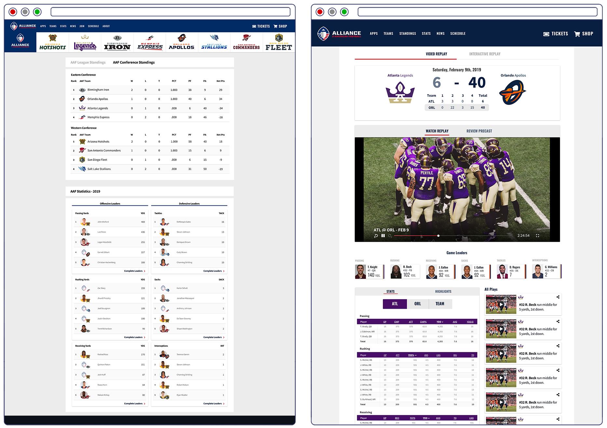
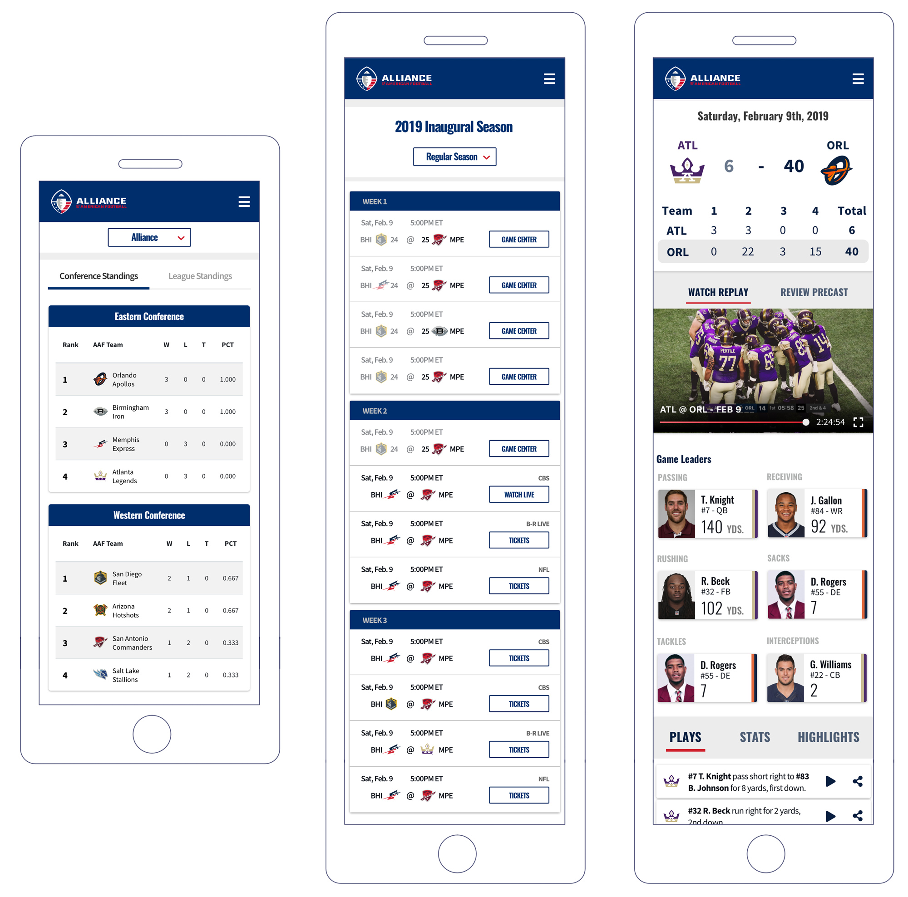

AAF was the tech-centric pro football league offering a digital interactive experience allowing fans to experience and interact with the game on a play-by-play level. The site offered multi-feed video streaming and paired real-time player telemetry with 3D interactivity. Standard features of a sports league web platform also included - stats for players, teams, league, standings, ticket sales, etc.

The experience was akin to an ongoing hackathon. I started 6 days before the launch of the inaugural season. Operating at a hackathon pace was absolutely correct. Unfortunately for me, the awesome experience only lasted 2 months and change due to the implosion of the league. The experience gave new meaning to working fast and being nimble for me. The new web platform was launched the night before the first game. There were 4 games every weekend. We pushed new features and updates between games, EVERY game. A newer version of the web platform was deployed on a weekly basis. It was nice to see some of the fans acknowledge that on Reddit :)

Working with a team of 3 engineers building a product that would garner 13 million eyeballs, iterative design and prioritization was critical. This meant having an in-depth understanding of technical feasibility and implementation time intensity, while balancing demands from management and page visibility from Google Analytics. For every feature, I designed at least 3 variants - VP (viable product), MVP, and MMVP. I worked solely in high-fidelity to minimize misinterpretations from design to implementation.

### Landing Page Iterations
##### Desktop

##### Mobile

After the first week, we saw that our users were overwhelmingly mobile at gametime so we shifted our design process to be mobile first.

### Team Tickets Iterations

To prioritize pages and features, I used a spreadsheet to compare technical feasibility, management priority, and page visibility from Google Analytics.

##### Mobile

##### Desktop

### Process Documents
##### User Flow

##### Data Organization

### Other Site Snapshots
##### Stats and Game Center

##### Standings, Schedule, and Game Center on Mobile

