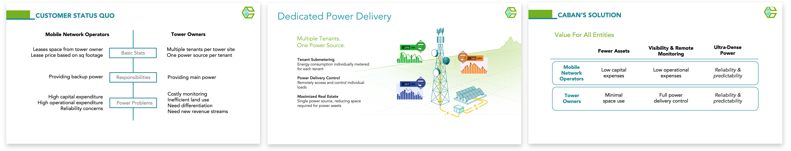

Caban Systems designs and manufactures lithium-ion energy storage systems for backup and off-grid telecom applications. The storage systems uniquely offer discrete load monitorning, making it easier for customers to host multiple tenants on site. The energy management software allows customer to monitor sites remotely and track and bill for the energy usage of each customer on site. I worked on the product design of the energy management software.

### Sample Screens

### Process Documents

After stakeholder interviews, I assembled a quick presentation to make sure everyone was in alignment about the pain points of our customers and where the software complements the hardware to address the pain points.

I broke down the software needs and visualized the core sections in low fidelity.

For each main section of the software, we prioritized and evaluated features by weighing the sentiment from the customer against the technical feasibility of the implementation. We spoke to representatives from 9 customer companies first with open conversation folowed by a pre-set questionaire to evaluate the resonance of each feature with each of them. We use then used the evaluation scores to decide the implementation phase of each feature. 

### User Flows

I generated user flows for each phase of implementation.

