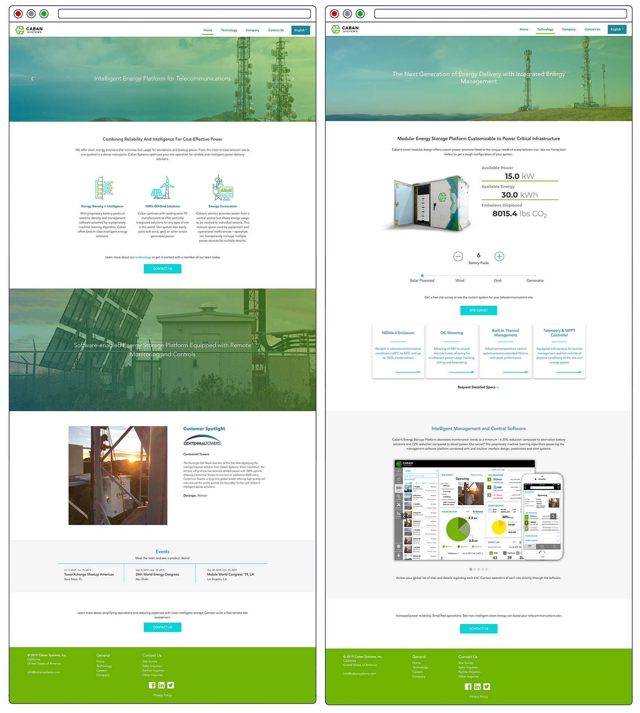
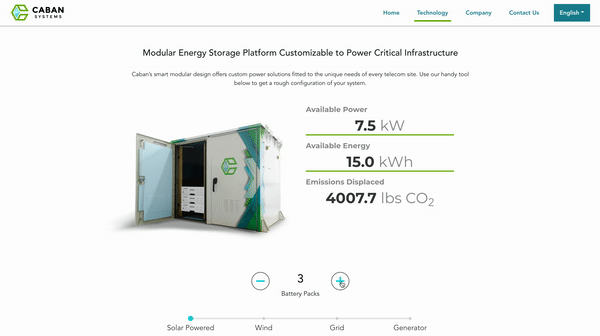
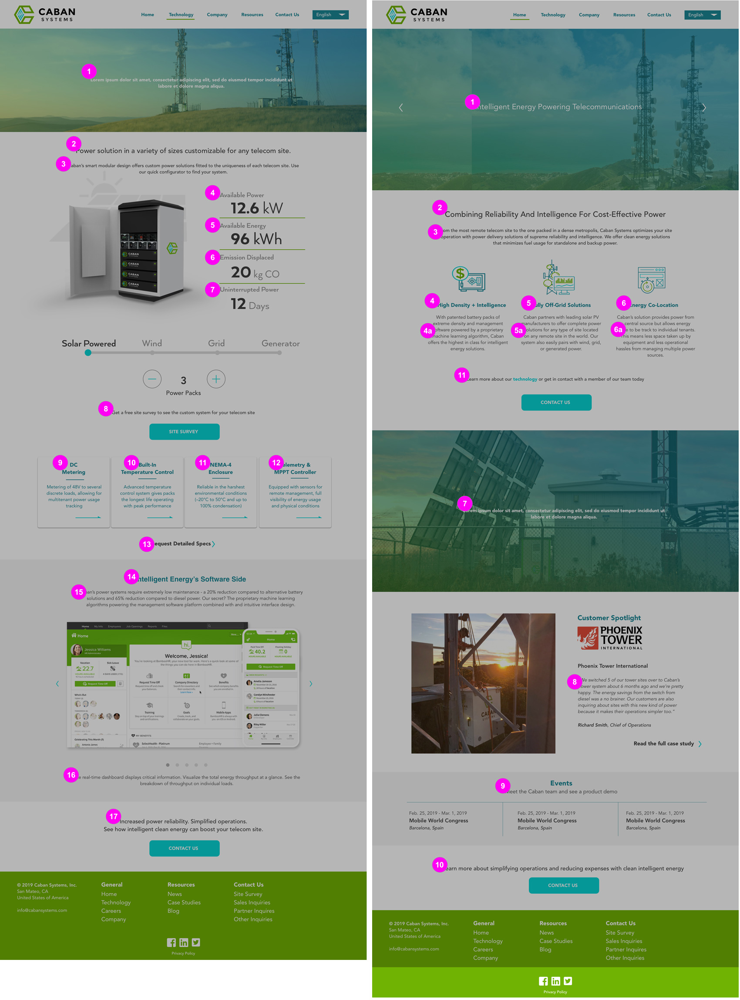
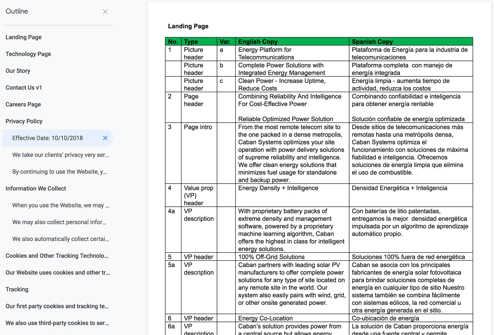
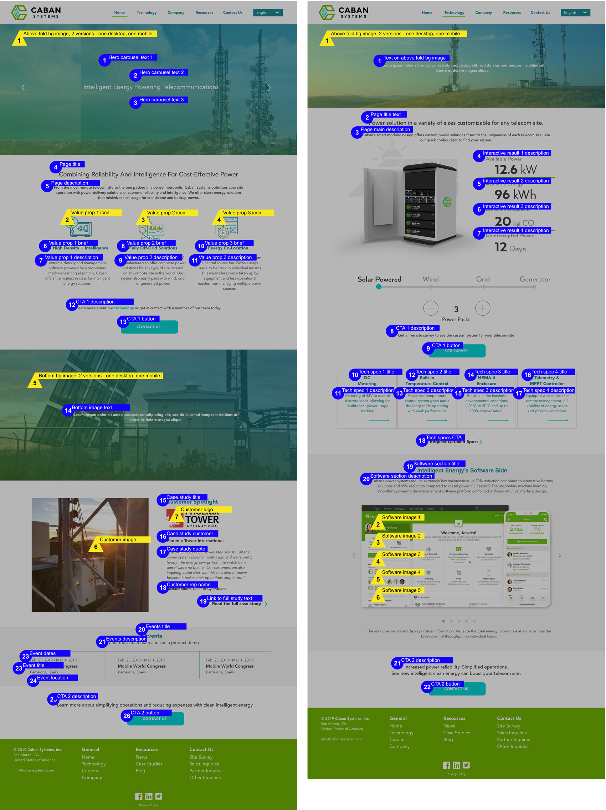
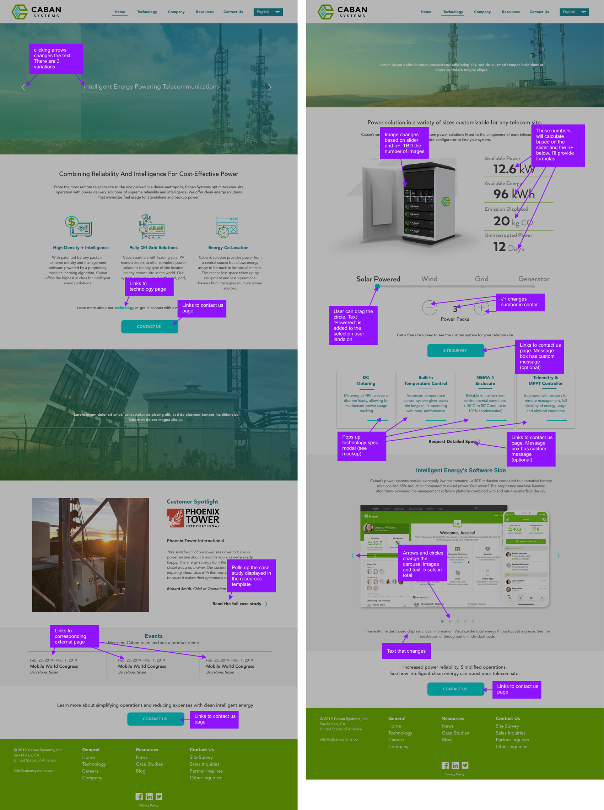

Caban Systems designs and manufactures smart energy storage systems for telecommunication sites. The energy-dense packs are specialized for remote off-grid sites. The systems are also equipped with direct current metering, allowing tower site owners to track individual loads - the first to offer energy co-location for the telecommunication industry.

I tag teamed with a front-end developer that I previously worked with at the Alliance Of American Football. The site has some standard elements but the new challenge was creating a multilingual site. I modify my usual process and added some additional steps.

Visit the live site: <a href="https://www.CabanSystems.com">www.CabanSystems.com</a>

### Site Screenshots

This part brought me much joy:

### Process Documents

Crafting the right message through the copy was a collaborative process between me, my CEO, and COO. We worked in a word document to refine the copy. I created these copy indicator guides where the sections are numbered to use as a reference for the word document. The indicator documents were also used for our team member that translated the copy into Spanish. Using these as guides, she was able to make sure the translated copy fitted into the layout.

I also needed to create guides to let the developer know which elements needed to be in the content management system so that someone on the marketing side could easiliy update it.

I skipped the usual site user flow this time since I was familiar the working style of the developer. Instead, I simply created guides that noted the interaction and flow over the mockups.

