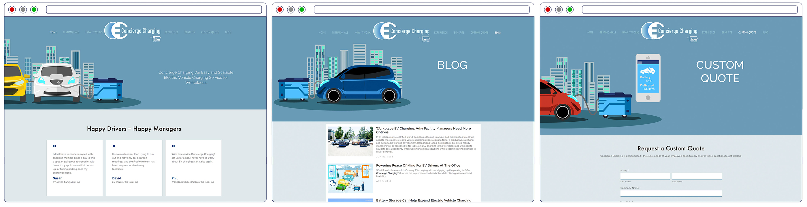
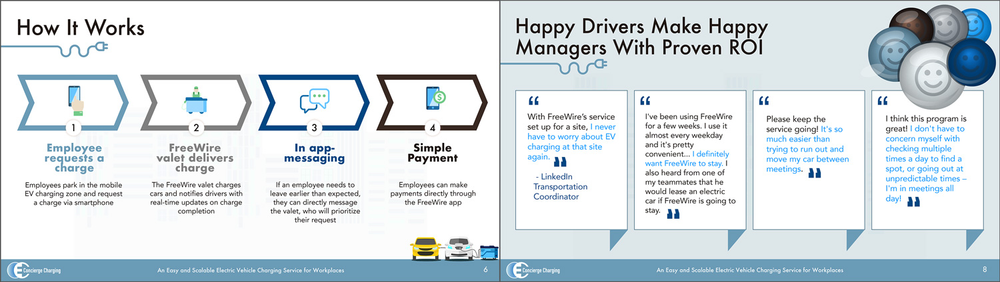
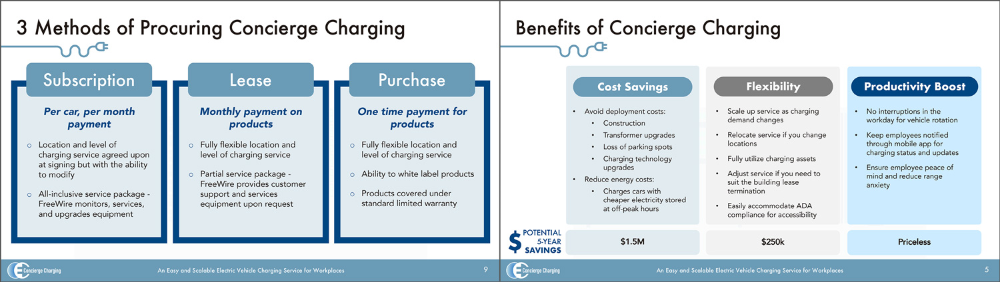

FreeWire Technologies builds cloud-connected battery systems for on-site power and battery-backed EV charging. The mobile version of the battery system can be uniquely used to deliver an on-demand charging service for electric vehicles. The company wanted to spin that off as a distinct offering with a separate brand. I explored the brand identity, developed the messaging and visual styling, and built out the website.

### Site Screenshots

### Sales Material Snapshots

