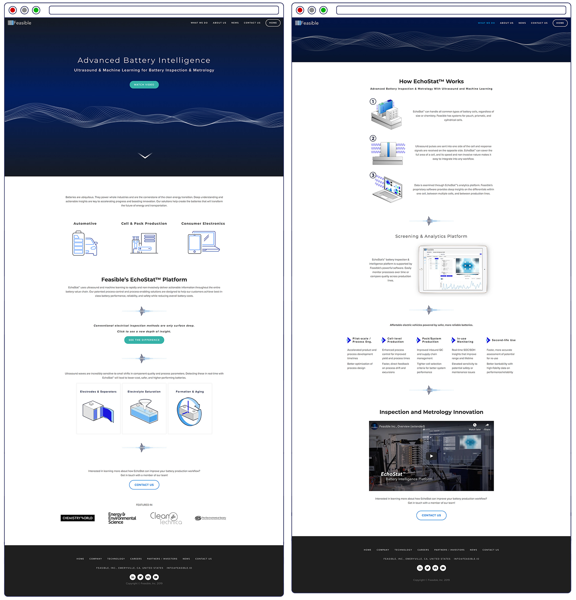
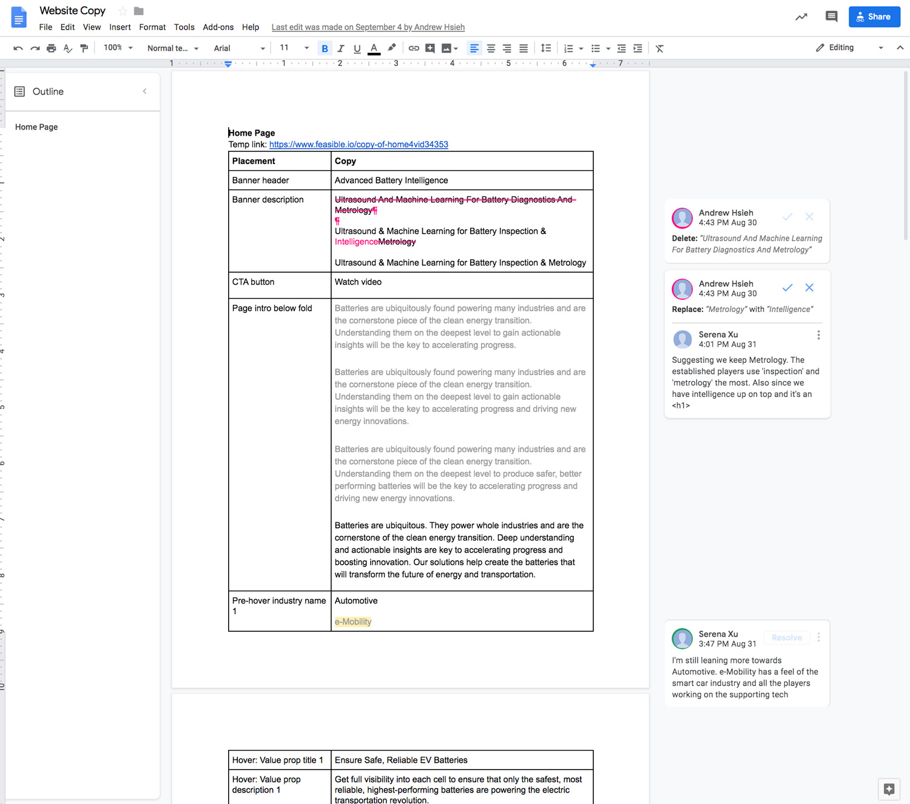
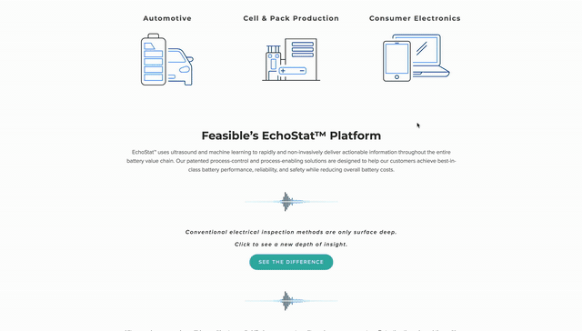
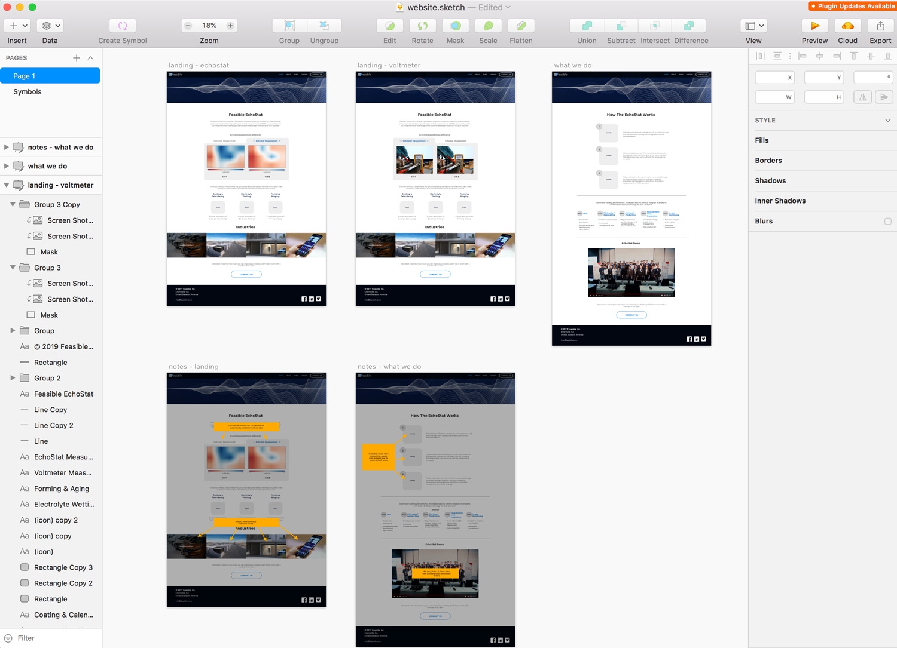

Feasible Inc., is a pioneer in battery inspection and metrology. Their EchoStat platform combines ultrasound and machine learning to screen battery cells on structural level for results of unprecedented accuracy. This breakthrough test method is a rapid non-invasive test method that tackles the biggest challenges in battery manufacturing.

Visit the live site: <a href="https://www.feasible.io">www.Feasible.io</a>

### Site Screenshots

### Process Documents

Measuring the health of a battery cell is a very esoteric topic. Despite 3 years of being deeply embedded in a battery systems company, I didn't hadn't gone deep into it. I ramped up with heavy reading of the Princeton University published papers from the founders and longer than usual interviews with the team.

I wrote up the first draft of the website copy in a shared google doc to allow collaboration from the CEO. 

This addition to the site was born out of an interview with 2 engineers. They voiced their frustration that when they speak about their technology, the points are difficult to grasp. "However, the audience's eyes light up after seeing us demo a voltmeter measurement in comparison to ours" I decided that had to be visualized on the site.

The work on the website design started with conventional layout and style mockups.

But in a small startup where you play the marketer, designer, and developer you can let some sideways movement slide. The version of the site in the original mockups was brought to life. Soon after, many new ideas spawned and we took a very ad-hoc approach in bringing about new updates - lots of pencil and paper, whiteboarding, and verbal communication.