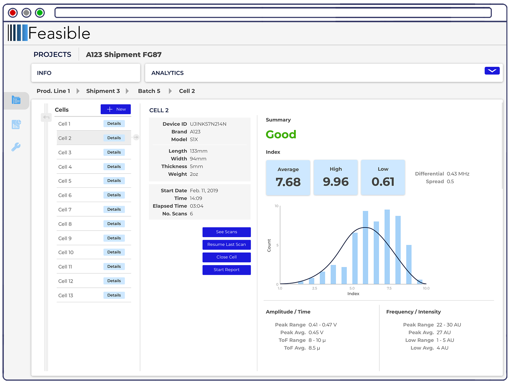
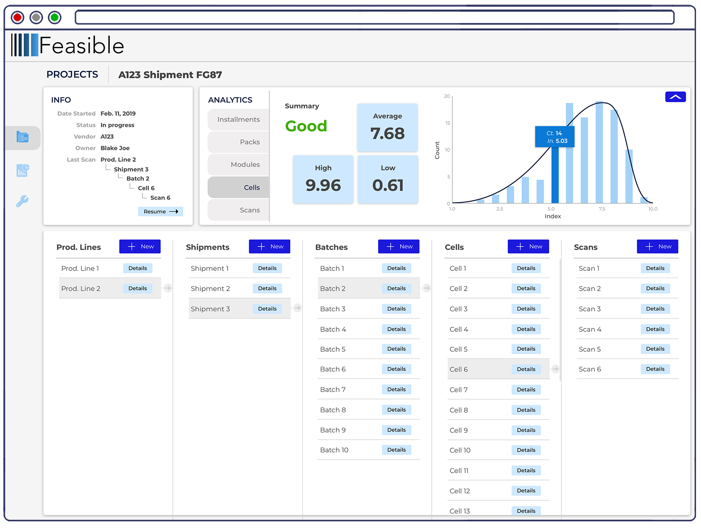
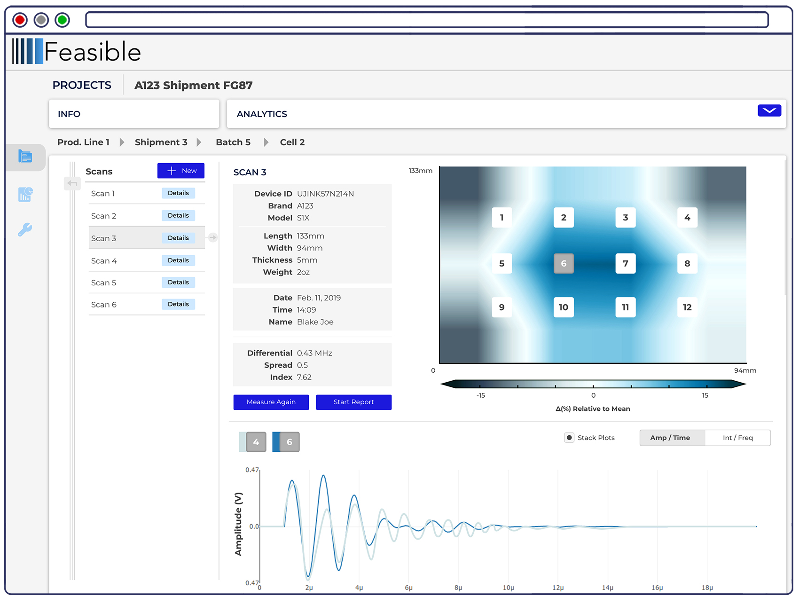
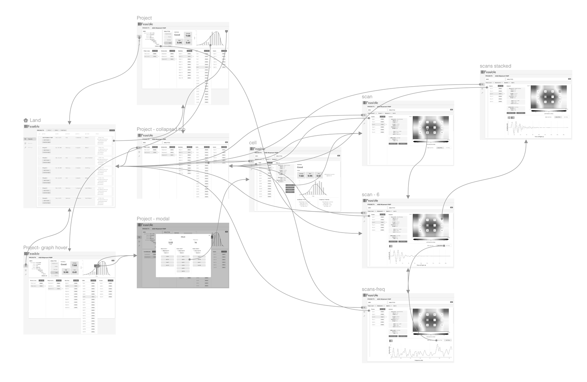
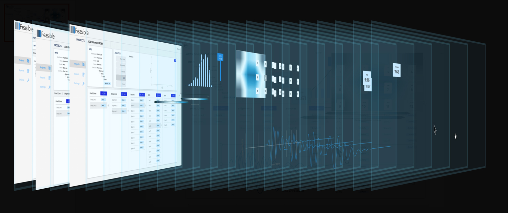
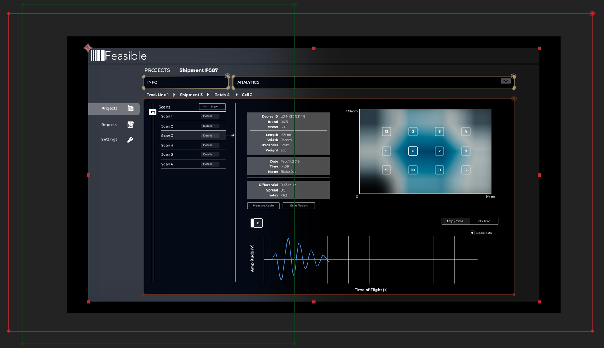

Feasible Inc. is a pioneer in battery inspection and metrology. The Battery Intelligence Platform combines ultrasound and machine learning to screen battery cells on structural level to give results of unprecedented accuracy. This breakthrough test method is a rapid non-invasive test method that tackles the biggest challenges in battery manufacturing.

This software mockup was created to serve for promotional purposes - product demonstrations, informational videos - and to facilitate customer conversations.

### Video Demo

<iframe width="560" height="315" src="https://www.youtube.com/embed/KomWLR_tkR0" frameborder="0" allow="accelerometer; autoplay; encrypted-media; gyroscope; picture-in-picture" allowfullscreen></iframe>

### Software Screenshots

### User Flow

### Video Procedure

The software portion of the video was built in After Effects rather than exporting an interactive proptotype. I wanted more options to for more graphical visuals and motion.

Software elements individually exported

Effects applied to achieve the visual style of the main promotional card

