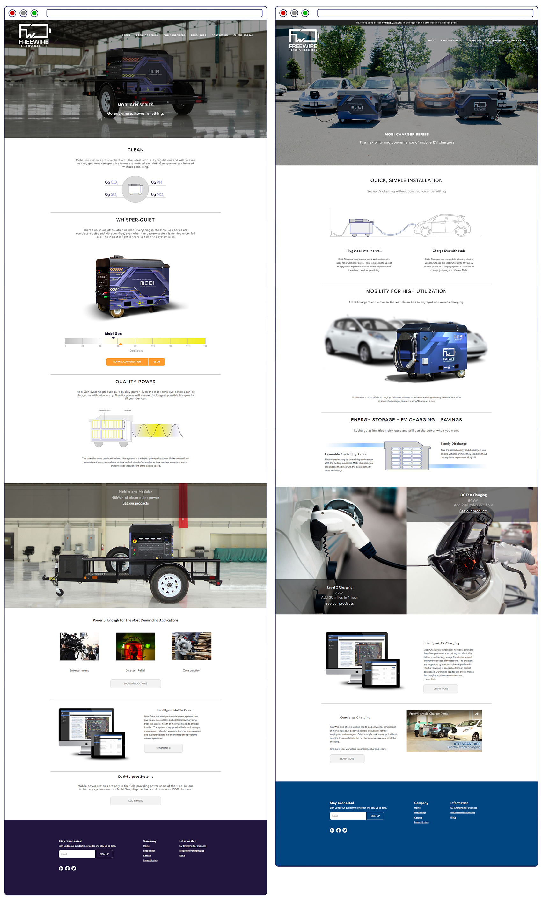
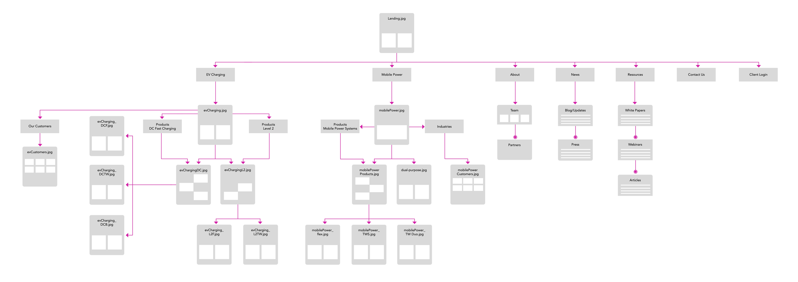
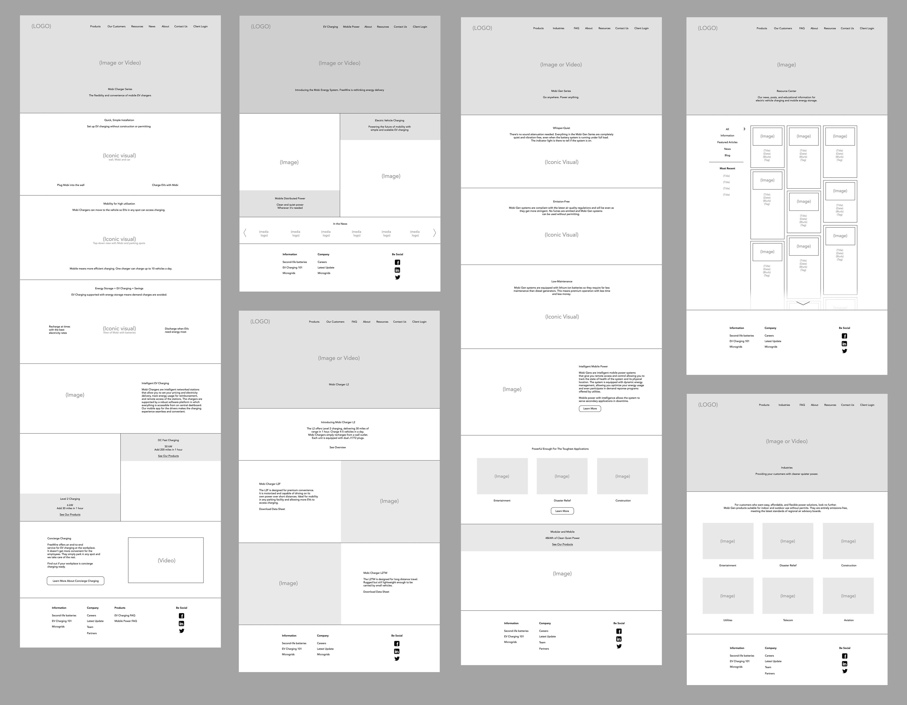
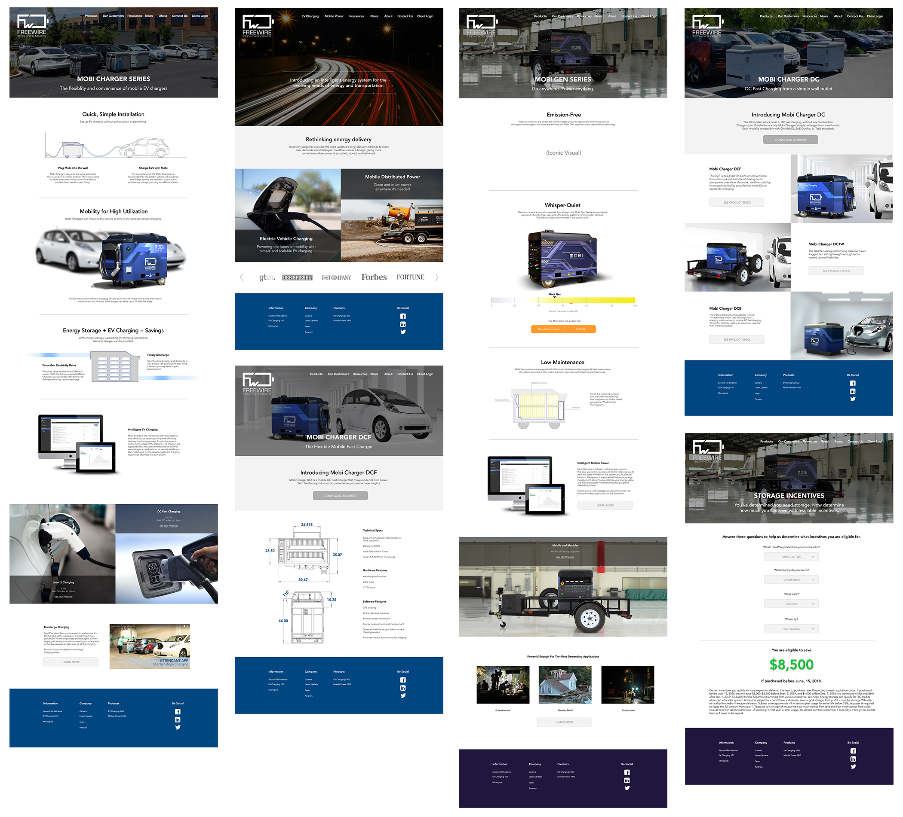
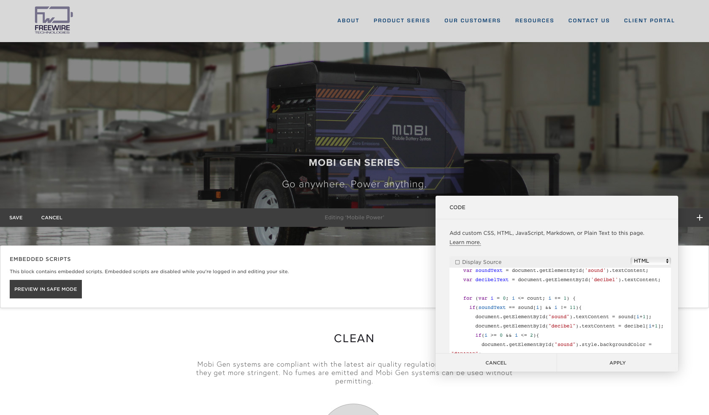

FreeWire Technologies builds cloud-connected battery systems for on-site power and battery-backed EV charging. This was company website from 2016 to early 2019. Design and implementaion was a one-woman task for me. 💪

### Site Screenshots

### Process Documents

Copy messaging was a collaborative effort between me and the stakeholders. I made a few documents to assist with the process.

##### Site Map

##### Low Fidelity With Copy Placement

##### High Fidelity

I created high fidelity mockups to align the team on visual look and feel.

Build time! The site was created with a Square Space starter and lots and lots of custom code blocks. I knew this way of building was not optimal and would eat into our site loading speeds but I decided it was more important to push out the site. I simply flagged it as an issue to dig into heavily later on. 

