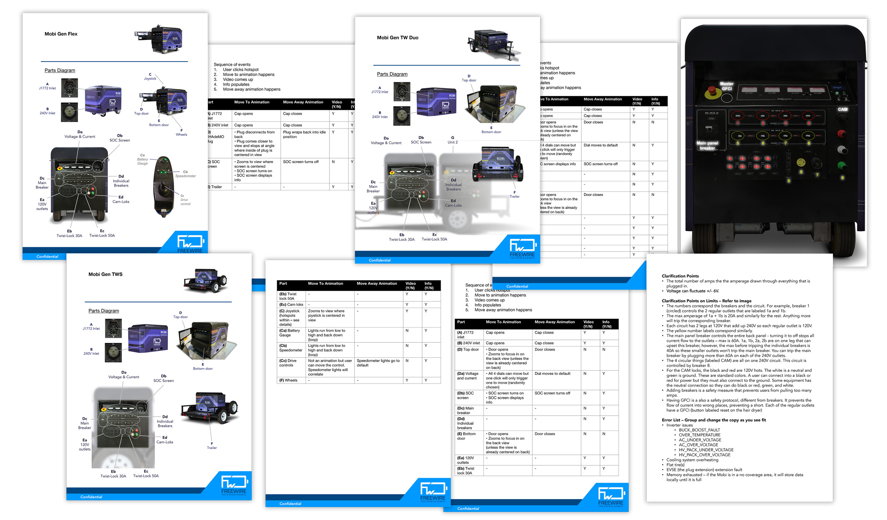

FreeWire Technologies builds cloud-connected mobile battery systems from second-life electric vehicle batteries. The Mobi Gen line is a series of clean, quiet battery alternatives to diesel generators.

A digital interface was to be added to Mobi Gen to increase its usability by providing more direct feedback. The constraint was the 7 x 5 resistive screen to be designed on. The challenge was an extreme case of bridging old and new technologies - diesel generators were the long established status quo. While the engine technology undergoes constant improvements, its interaction with the user remained largely unchanged. I led a team of 3 design consultants to tackle this challenge. The deliverables were InVision prototypes, flow charts, site map, and annotated wireframes.

### Product Screens

### Process Documents

We started with visioning session with key decision makers in the company. 

I packaged all existing information on our product such as guides, datasheets, and created a more detailed technical document on the nuances of the product.

I took our design consultants to conduct a series of interviews with targeted end-users and documented everything - photos, notes, sketches, and video.

The design consultants synthesized their findings and I presented our progress to our excecutive team.

##### Site Map

##### User Flow Chart

After the consultants gave their assessment and designed the ideal interface, the design had to be modified to what was executable within the bandwidth of the current software team. In order to align with our engineering team's available bandwidth, I created 2 levels of pared down options - a minimum viable and a medium viable design flow.

