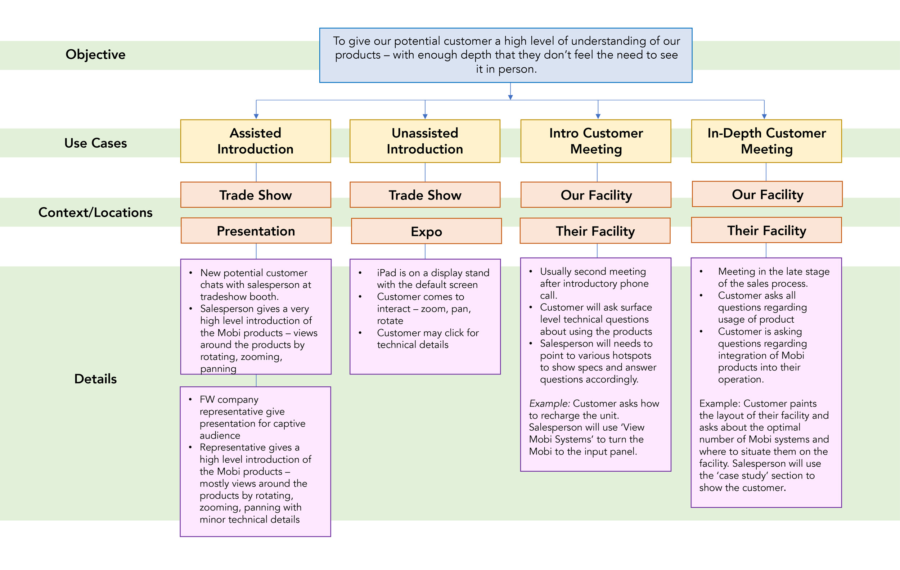
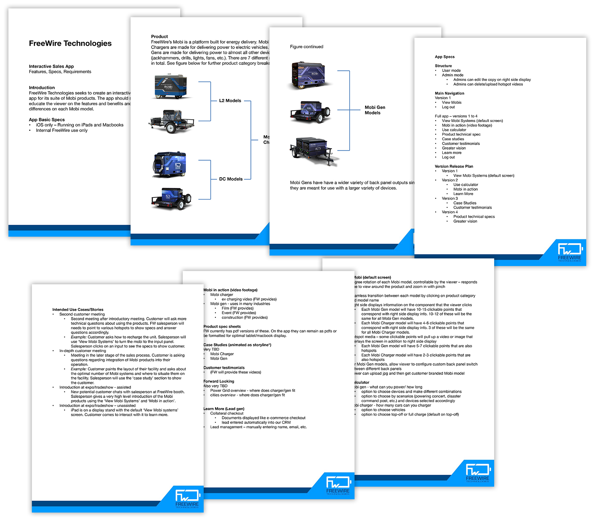
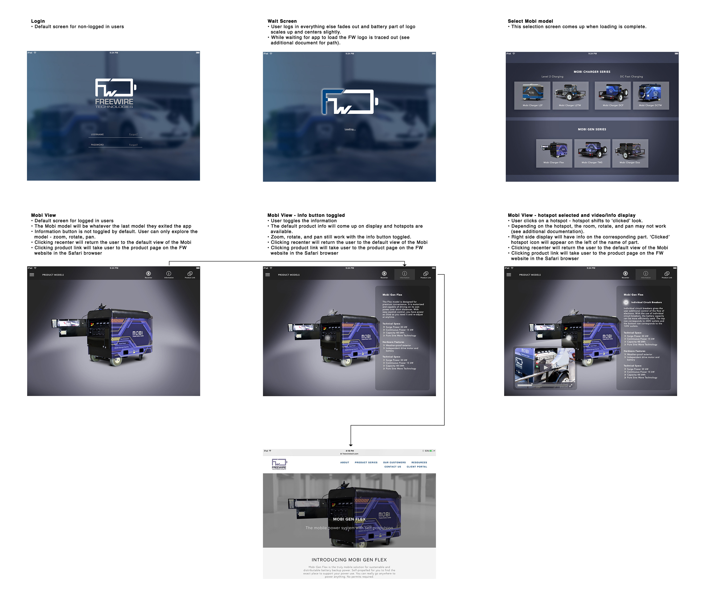
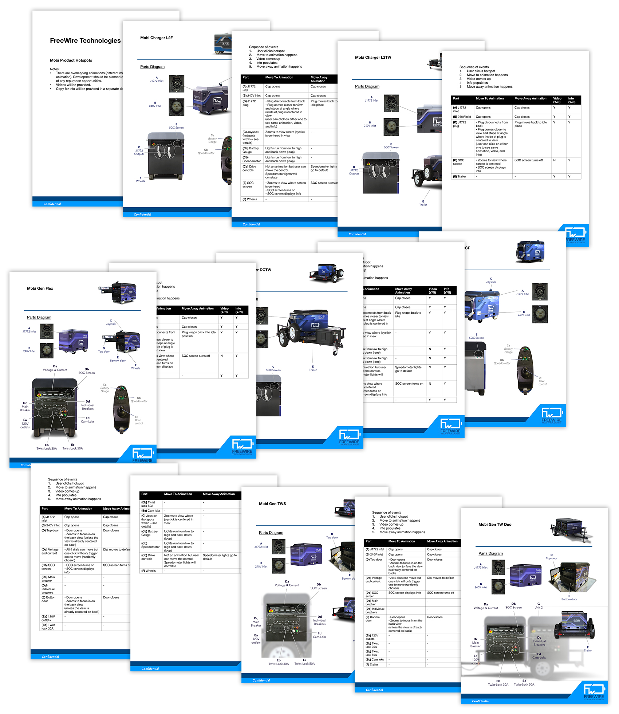

FreeWire Technologies builds cloud-connected battery systems for on-site power and battery-backed EV charging. This interactive iPad app was created as a sales and marketing tool to allow our team to demo to prospective customers without physically moving a 1600 lb battery system around. The interactive app with the products built in 3D would allow customers to rotate, zoom, and pan around the product and also to simulate the operation.

### Sample Screens

### Process Documents

The first part of the process was to fully understand a typical customer's journey to purchase such a high-ticket item such as ours. After numerous customer interviews and scouring our CRM and notes from in-person meetings, I visualized the customer journey map for our team to dissect.

Then I drew out the potential uses cases where the app would be used for our team to disseminate.

After the official kickoff of product development, I created an introductory spec document to retrieve quotes from various developers and agencies.

I created a simple document to guide the user flow and the visual styling.

As we got heavier into the development, I created a guide to deep dive into the features of the battery product so we could accurately simulate it on the app.

